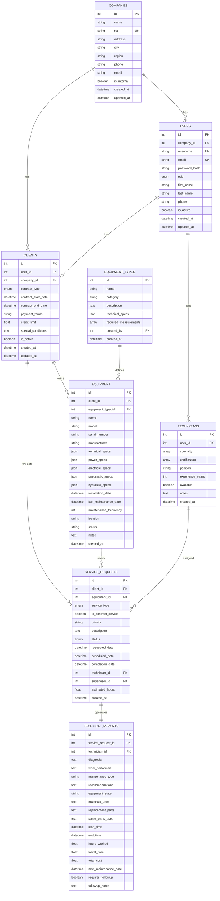

```mermaid
erDiagram
    COMPANIES ||--o{ USERS : has
    COMPANIES ||--o{ CLIENTS : has
    USERS ||--o{ TECHNICIANS : has
    USERS ||--o| CLIENTS : has
    CLIENTS ||--o{ EQUIPMENT : owns
    EQUIPMENT_TYPES ||--o{ EQUIPMENT : defines
    CLIENTS ||--o{ SERVICE_REQUESTS : requests
    EQUIPMENT ||--o{ SERVICE_REQUESTS : needs
    TECHNICIANS ||--o{ SERVICE_REQUESTS : assigned
    SERVICE_REQUESTS ||--|| TECHNICAL_REPORTS : generates

    COMPANIES {
        int id PK
        string name
        string rut UK
        string address
        string city
        string region
        string phone
        string email
        boolean is_internal
        datetime created_at
        datetime updated_at
    }

    USERS {
        int id PK
        int company_id FK
        string username UK
        string email UK
        string password_hash
        enum role
        string first_name
        string last_name
        string phone
        boolean is_active
        datetime created_at
        datetime updated_at
    }

    TECHNICIANS {
        int id PK
        int user_id FK
        array specialty
        array certification
        string position
        int experience_years
        boolean available
        text notes
        datetime created_at
    }

    CLIENTS {
        int id PK
        int user_id FK
        int company_id FK
        enum contract_type
        datetime contract_start_date
        datetime contract_end_date
        string payment_terms
        float credit_limit
        text special_conditions
        boolean is_active
        datetime created_at
        datetime updated_at
    }

    EQUIPMENT_TYPES {
        int id PK
        string name
        string category
        text description
        json technical_specs
        array required_measurements
        int created_by FK
        datetime created_at
    }

    EQUIPMENT {
        int id PK
        int client_id FK
        int equipment_type_id FK
        string name
        string model
        string serial_number
        string manufacturer
        json technical_specs
        json power_specs
        json electrical_specs
        json pneumatic_specs
        json hydraulic_specs
        datetime installation_date
        datetime last_maintenance_date
        int maintenance_frequency
        string location
        string status
        text notes
        datetime created_at
    }

    SERVICE_REQUESTS {
        int id PK
        int client_id FK
        int equipment_id FK
        enum service_type
        boolean is_contract_service
        string priority
        text description
        enum status
        datetime requested_date
        datetime scheduled_date
        datetime completion_date
        int technician_id FK
        int supervisor_id FK
        float estimated_hours
        datetime created_at
    }

    TECHNICAL_REPORTS {
        int id PK
        int service_request_id FK
        int technician_id FK
        text diagnosis
        text work_performed
        string maintenance_type
        text recommendations
        string equipment_state
        text materials_used
        text replacement_parts
        text spare_parts_used
        datetime start_time
        datetime end_time
        float hours_worked
        float travel_time
        float total_cost
        datetime next_maintenance_date
        boolean requires_followup
        text followup_notes
    }
```
